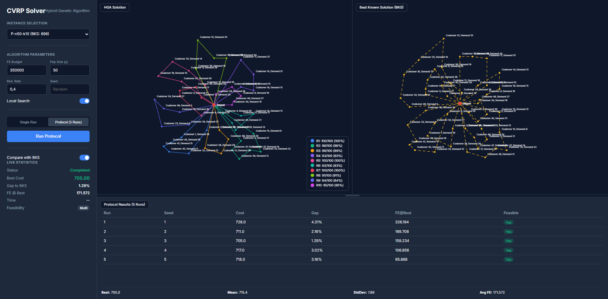

# CVRP Hybrid Genetic Algorithm Solver

A modular, production-ready Python solver for the **Capacitated Vehicle Routing Problem (CVRP)** using a **Hybrid Genetic Algorithm (HGA)** with local search refinement. It features a modern, interactive **Research Dashboard** for visualizing routes, convergence, and analyzing protocol runs.

## Architecture

```
CWD/
├── src/
│   ├── models.py          # Instance, Solution, FitnessTracker, HGAConfig
│   ├── parser.py          # TSPLIB .vrp file parser
│   ├── distance.py        # Euclidean distance matrix (EUC_2D)
│   ├── split.py           # Prins' Split algorithm (giant tour → routes)
│   ├── initialization.py  # Population seeding (Nearest Neighbor + random)
│   ├── operators.py       # Tournament selection, OX1 crossover, mutations
│   ├── local_search.py    # 2-opt (intra), Relocate, Exchange (inter)
│   └── hga.py             # HGA orchestrator class
├── static/                # Frontend Web Dashboard Assets
│   ├── index.html         # Dashboard UI layout
│   ├── style.css          # Dark-themed responsive styling
│   └── app_v7.js          # Interactive map rendering & API communication
├── web_app.py             # FastAPI backend server & REST endpoints
└── main.py                # CLI runner for batch execution
```

## Algorithm

- **Representation:** Giant tour (permutation) + Prins' Split for optimal decoding
- **Crossover:** Order Crossover (OX1)
- **Mutation:** Swap + Inversion + Insertion (independent probabilities)
- **Local Search:** 2-opt (intra-route) → Relocate → Exchange (inter-route), first-improvement
- **Replacement:** (μ + λ) elitist with duplicate elimination
- **Stopping criterion:** 350,000 Fitness Evaluations (strict FE budget)

## Setup

```bash
python -m venv .venv
.venv\Scripts\activate     # Windows
pip install -r requirements.txt
```

## Usage

### 1. Web Dashboard (Interactive Mode)
Launch the FastAPI server to access the Research Dashboard:
```bash
python web_app.py
```
Then open `http://127.0.0.1:8000` in your browser.



**Dashboard Features:**
- **Single Run:** Executes the HGA once. Visualizes the final routes mapped on a 2D canvas, alongside the live Convergence Plot (fitness vs. FE).
- **Protocol (5 Runs):** Executes 5 independent seeded runs. Displays an aggregate summary table (Best, Mean, StdDev, FE@Best) and visualizes the best overall route.
- **BKS Comparison:** Toggle overlay to compare the HGA solution against the Best Known Solution (BKS) side-by-side.
- **Dynamic Layout:** Resizable panels between the map view and the analysis views.

### 2. CLI Runner (Batch Mode)
To run the automated protocol on all 10 benchmark instances (A, B, E, P sets) via command line:
```bash
python main.py
```
**CLI Output:**
- **Console:** Formatted summary table per instance
- **CSV:** `output/results.csv` with Best, Mean, Std Dev, Gap%, Satisfiability, Avg FE@best
- **Plots:** `output/{instance}_convergence.png` for selected instances

## Benchmark Instances

| Instance    | Customers | Capacity | BKS   |
|-------------|-----------|----------|-------|
| A-n45-k7    | 44        | 100      | 1146  |
| A-n60-k9    | 59        | 100      | 1354  |
| A-n80-k10   | 79        | 100      | 1763  |
| B-n56-k7    | 55        | 100      | 707   |
| B-n66-k9    | 65        | 100      | 1316  |
| B-n78-k10   | 77        | 100      | 1221  |
| E-n76-k8    | 75        | 140      | 735   |
| E-n101-k14  | 100       | 112      | 1071  |
| P-n50-k10   | 49        | 160      | 696   |
| P-n101-k4   | 100       | 400      | 681   |
